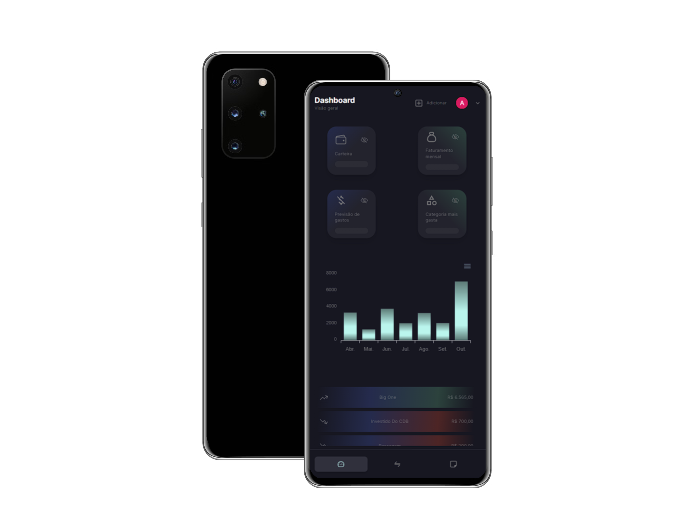
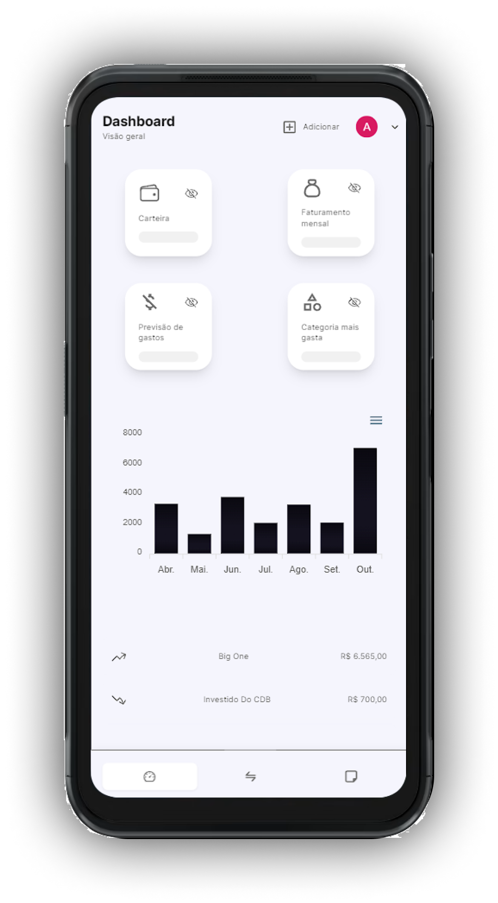
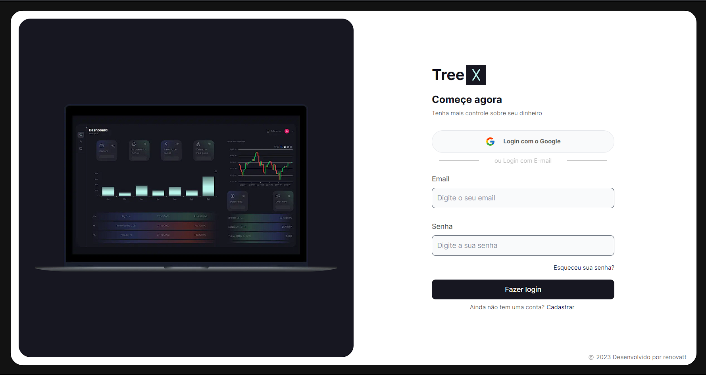
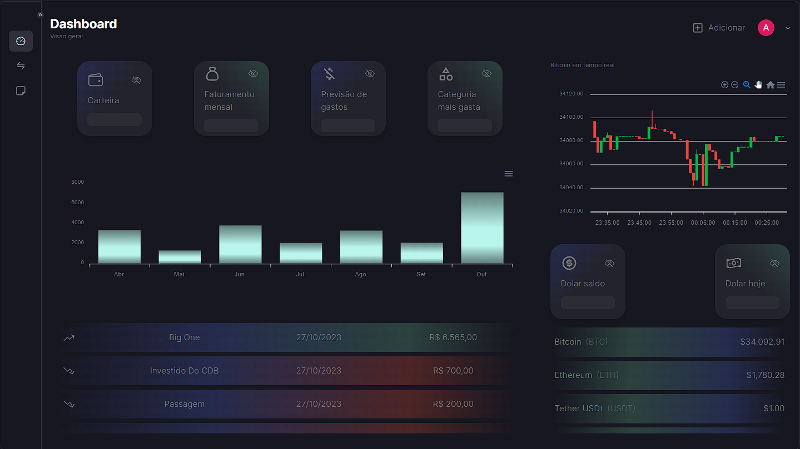
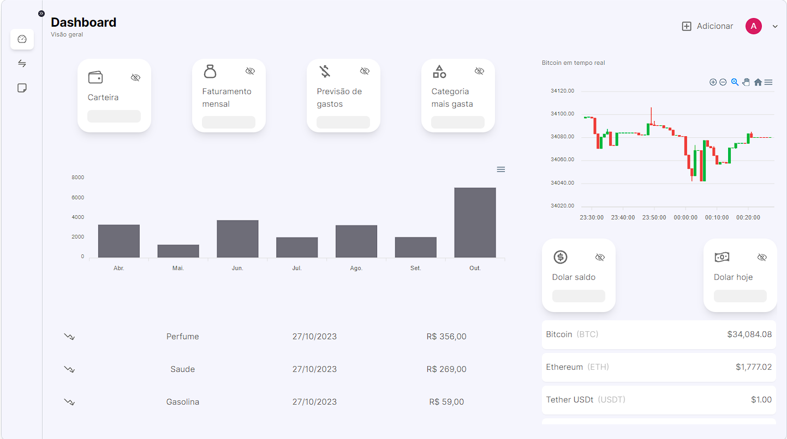
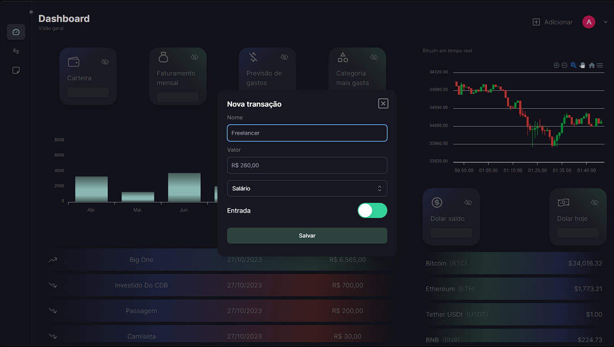
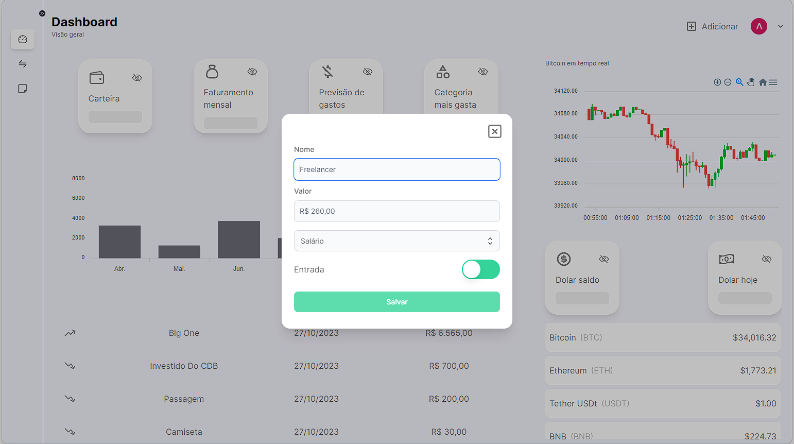

</h1>
   
<h1>Treex</h1> 

## Descrição

### "Estou empolgado em apresentar a evolução do meu primeiro projeto solo em React.js, agora construído em [Next.js 13.5](https://nextjs.org/docs). Apresento o [Treex](https://treex.vercel.app/), um sistema financeiro inovador que permite que você gerencie suas despesas e ganhos. Com o [Treex](https://treex.vercel.app/), você terá uma visão abrangente de suas finanças, incluindo um gráfico de faturamento dos últimos 7 meses, juntamente com a capacidade de filtrar despesas por categoria e visualizar seus ganhos mensais ou diários.

### Além disso, o [Treex](https://treex.vercel.app/) oferece informações atualizadas sobre as ``50 criptomoedas em alta`` e o valor do ``dólar atual``. Estamos integrando a ``API da Binance`` para fornecer dados em tempo real do ``Bitcoin`` via ``WebSockets``, mantendo você sempre atualizado com as últimas informações do mercado.

### O [Treex](https://treex.vercel.app/) também inclui uma seção de anotações para que você possa planejar suas despesas futuras e manter uma lista de prioridades financeiras em ordem. Para garantir segurança e facilidade de uso, estamos utilizando o ``Firebase`` como ``banco de dados`` e ``autenticação``, mantendo a mesma abordagem confiável do nosso projeto anterior.

### Além das melhorias funcionais, o [Treex](https://treex.vercel.app/) também recebeu uma atualização de design, oferecendo aos usuários um tema atraente com modos claro e escuro. Estou entusiasmado em compartilhar essa jornada de evolução e aprimoramento, e espero que o [Treex](https://treex.vercel.app/) seja uma ferramenta valiosa para você no gerenciamento de suas finanças."

[Ver Projeto](https://treex.vercel.app/)

#

## Layout mobile

## Layout web
 

 

## 🛠️ Tecnologias

💻 **Front-end**
- [Next.js 13.5.4](https://nextjs.org)
- [Typescript](https://www.typescriptlang.org)

📚 **Bibliotecas**
- [zustand](https://zustand-demo.pmnd.rs/)
- [zod](https://zod.dev/)
- [react-query](https://tanstack.com/query/latest/docs/react/overview)
- [nookies](https://www.npmjs.com/package/nookies)
- [next-pwa](https://www.npmjs.com/package/next-pwa)
- [apexcharts](https://apexcharts.com/)
- [react-hook-form](https://react-hook-form.com/)
- [react-hot-toast](https://react-hot-toast.com/)
- [react-icons](https://react-icons.github.io/react-icons/)
- [uuid-v4](https://www.npmjs.com/package/uuid)
- [axios](https://axios-http.com/ptbr/docs/intro)

🔌 **APIs**
- [awesomeapi](https://docs.awesomeapi.com.br/)
- [coinmarketcap](https://coinmarketcap.com/pt-br/)
- [binance](https://binance-docs.github.io/apidocs/spot/en/#old-trade-lookup)

🎨 **Estilização**
- [tailwindcss](https://tailwindcss.com/docs/installation)
- [frame-motion](https://www.framer.com/motion/)
- [swiper](https://swiperjs.com/demos)
- [flowbite](https://flowbite.com/)
- [next-themes](https://www.npmjs.com/package/next-themes)

📁 **Back-end**
- [firebase](https://firebase.google.com/?hl=pt)

🔋 **Versionamento e Deploy**
- [Git](https://git-scm.com)
- [Vercel](https://vercel.com/)

 

⚙️ **Configuranções e Instalações**

Clone do Projeto

    $ git clone https://github.com/renovatt/treex.git

Instalando as dependências

    $ npm install

Iniciando o projeto

    $ npm run dev

 

**Como contribuir?**

- Você pode dar suporte me seguindo aqui no GitHub
- Dando uma estrela no projeto
- Criar uma conexão comigo no linkedin fazendo parte da minha networking e curtir o meu projeto.

 

**Autor**
[Wildemberg Renovato de Lima](https://www.linkedin.com/in/renovatt/)